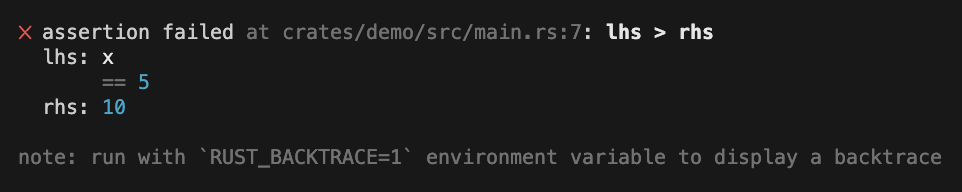

<!--
Copyright (c) 2023 Sophie Katz

This file is part of test ur code XD.

test ur code XD is free software: you can redistribute it and/or modify it under the terms of the
GNU General Public License as published by the Free Software Foundation, either version 3 of the
License, or (at your option) any later version.

test ur code XD is distributed in the hope that it will be useful, but WITHOUT ANY WARRANTY; without
even the implied warranty of MERCHANTABILITY or FITNESS FOR A PARTICULAR PURPOSE. See the GNU
General Public License for more details.

You should have received a copy of the GNU General Public License along with test ur code XD. If
not, see <https://www.gnu.org/licenses/>.
-->

# test ur code XD :3

   [](https://github.com/sophie-katz/test-ur-code-XD/actions/workflows/github-pages.yml)

This crate tries to improve testing in Rust with a more full-featured framework. It makes tests more readable with better assertions and with more readable errors:



## Usage

Add this to your `Cargo.toml` to use:

```toml
[dev-dependencies]
test-ur-code-XD = "^0.1.0"
```

Read the [user guide](https://sophie-katz.github.io/test-ur-code-XD/) for instructions on how to use this crate in your own projects.

See [docs.rs](example.com) for the API documentation and [crates.io](example.com) to install.

## Features

### More assertions

* Floating-point assertions
* String assertions
* Panic assertions
* Output assertions for `stdout` and `stderr`
* Filesystem assertions

See the [user guide](https://sophie-katz.github.io/test-ur-code-XD/) for a full list of assertion macros you can use.

### Parameterized tests

```rust
#[test_with_parameter_values(
    x = [5, 6, 7],
    y = [1, 2])
]
fn example(x: i32, y: i32) {
    // This will permute the values and automatically run all of these cases:
    //   x == 5, y == 1
    //   x == 5, y == 2
    //   x == 6, y == 1
    //   x == 6, y == 2
    //   x == 7, y == 1
    //   x == 7, y == 2
}
```

<br />

<centered><i>This project uses <a href="https://github.com/sophie-katz/rust-vscode-template">rust-vscode-template</a>, which has instructions on how to use it.</i></centered>
