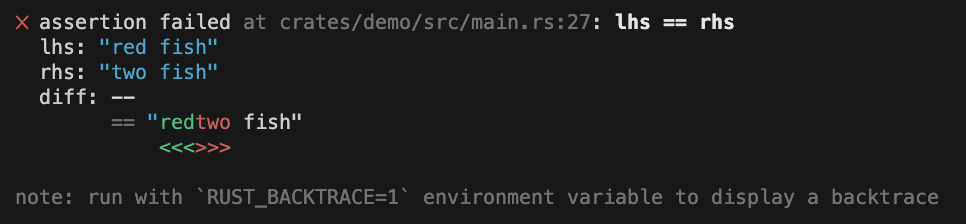

<!--
Copyright (c) 2023 Sophie Katz

This file is part of test ur code XD.

test ur code XD is free software: you can redistribute it and/or modify it under the terms of the
GNU General Public License as published by the Free Software Foundation, either version 3 of the
License, or (at your option) any later version.

test ur code XD is distributed in the hope that it will be useful, but WITHOUT ANY WARRANTY; without
even the implied warranty of MERCHANTABILITY or FITNESS FOR A PARTICULAR PURPOSE. See the GNU
General Public License for more details.

You should have received a copy of the GNU General Public License along with test ur code XD. If
not, see <https://www.gnu.org/licenses/>.
-->

# test ur code XD :3

[GitHub repository](https://github.com/sophie-katz/test-ur-code-XD) | [crates.io](http://www.example.com) | [docs.rs](http://www.example.com)

test ur code XD is a Rust crate that tries to improve testing with a more full-featured framework. It makes tests more readable with better assertions and with more readable errors.

<figure markdown>
  
  <figcaption>Example assertion</figcaption>
</figure>

<figure markdown>
  
  <figcaption>A string diff assertion</figcaption>
</figure>

## Features

### More assertions

* Floating-point assertions
* String assertions
* Panic assertions
* Output assertions for `stdout` and `stderr`
* Filesystem assertions

### Parameterized tests

```rust
#[test_with_parameter_values(
    x = [5, 6, 7],
    y = [1, 2])
]
fn example(x: i32, y: i32) {
    // This will permute the values and automatically run all of these cases:
    //   x == 5, y == 1
    //   x == 5, y == 2
    //   x == 6, y == 1
    //   x == 6, y == 2
    //   x == 7, y == 1
    //   x == 7, y == 2
}
```

## Comparison to other crates

| Category                  | test ur code XD | Built-in | [pretty_assertions](https://crates.io/crates/pretty-assertions) | [similar-asserts](https://crates.io/crates/similar-asserts) | [test-case](https://crates.io/crates/test-case) | [rstest](https://crates.io/crates/rstest) | [NTest](https://crates.io/crates/ntest) |
| ------------------------- | :-------------: | :------: | :-------------------------------------------------------------: | :---------------------------------------------------------: | :---------------------------------------------: | :---------------------------------------: | :-------------------------------------: |
| Pretty assertions         | ✔               |          | ✔                                                               | ✔                                                           |                                                 |                                           |                                         |
| Floating-point assertions | ✔               |          |                                                                 |                                                             |                                                 |                                           | ✔                                       |
| Diffing assertions        | ✔               |          | ✔                                                               | ✔                                                           |                                                 |                                           |                                         |
| Panic assertions          | ✔               |          |                                                                 |                                                             |                                                 |                                           | ✔                                       |
| Output assertions         | ✔               |          |                                                                 |                                                             |                                                 |                                           |                                         |
| Filesystem testing        | ✔               |          |                                                                 |                                                             |                                                 |                                           |                                         |
| Parameterized tests       | ✔               |          |                                                                 |                                                             | ✔                                               | ✔                                         |                                         |
| Test permutation          | ✔               |          |                                                                 |                                                             | ✔                                               | ✔                                         |                                         |
| Fixtures                  |                 |          |                                                                 |                                                             |                                                 | ✔                                         |                                         |
